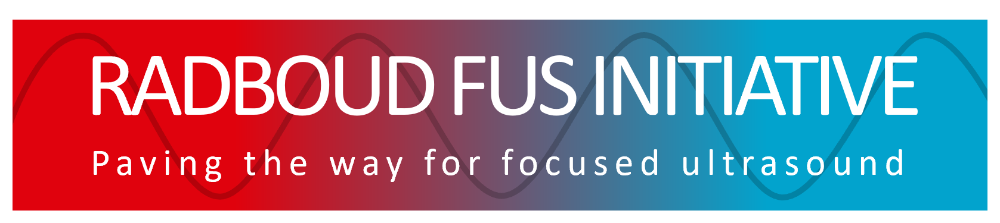
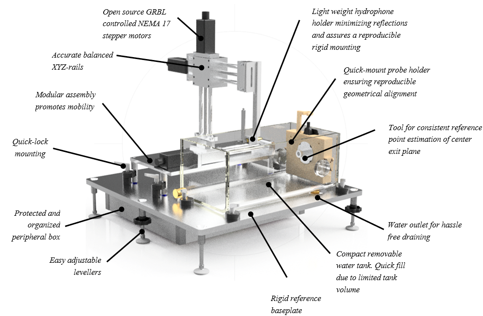

# Radboud FUS measurement kit
<a name="readme-top"></a>

<div align="center">
  

  

  
  
</div>

<div align="center">
  
  
  
</div>

<!-- TABLE OF CONTENTS -->

# 📗 Table of Contents

- [📖 About the Project](#about-project)
  - [Key Features](#key-features)
  - [👥 Authors](#authors)
  - [✒️ How to cite](#how-to-cite)
- [💻 Getting Started](#getting-started)
  - [Setup](#setup)
  - [Prerequisites](#prerequisites)
  - [Install](#install)
  - [Usage](#usage)
- [🔭 Future Features](#future-features)
- [🤝 Contributing](#contributing)
- [⭐️ Show your support](#support)
- [🙏 Acknowledgements](#acknowledgements)
- [📝 License](#license)

<!-- PROJECT DESCRIPTION -->

# 📖 Radboud FUS measurement kit <a name="about-project"></a>

> Describe your project in 1 or 2 sentences.

(Project id: **0003429** )

**Radboud FUS measurement kit** is a...

This project is facilitated by the Radboud Focused Ultrasound Initiative. For more information, please visit the [website](https://www.ru.nl/en/donders-institute/research/research-facilities/focused-ultrasound-initiative-fus).

<!-- Features -->

## Key Features <a name="key-features"></a>

> Describe between 1-3 key features of the application.

- **Affordable**
- **High quality**

<p align="right">(<a href="#readme-top">back to top</a>)</p>

<!-- AUTHORS -->

## 👥 Authors <a name="authors"></a>

👤 **[Stein Fekkes](https://www.ru.nl/en/people/fekkes-s), [FUS Initiative](https://www.ru.nl/en/donders-institute/research/research-facilities/focused-ultrasound-initiative-fus), Radboud University**

- GitHub: [@githubhandle](https://github.com/githubhandle)
- LinkedIn: [LinkedIn](https://linkedin.com/in/sfekkes)

👤 **[Margely Cornelissen](https://www.ru.nl/en/people/cornelissen-m), [FUS Initiative](https://www.ru.nl/en/donders-institute/research/research-facilities/focused-ultrasound-initiative-fus), Radboud University**

- GitHub: [@MaCuinea](https://github.com/MaCuinea)
- LinkedIn: [LinkedIn](https://linkedin.com/in/margely-cornelissen)

👤 **Erik Dumont, [Image Guided Therapy (IGT)](http://www.imageguidedtherapy.com/)**

- GitHub: [@githubhandle](https://github.com/githubhandle)
- LinkedIn: [LinkedIn](https://linkedin.com/in/erik-dumont-986a814)

<p align="right">(<a href="#readme-top">back to top</a>)</p>

## ✒️ How to cite <a name="how-to-cite"></a>

If you use this hardware in your research or project, please cite it as follows:

[ADD CITATION]

If you use this software in your research or project, please cite it as follows:

Margely Cornelissen (Radboud University, Nijmegen, The Netherlands) & Erik Dumont (Image Guided Therapy, Pessac, France) (2024), Radboud FUS measurement kit software (Version 0.8), [GITHUB-URL]

<!-- GETTING STARTED -->

## 💻 Getting Started <a name="getting-started"></a>

> Describe how a new developer could make use of your project.

To get a local copy up and running, follow these steps.

### Prerequisites

In order to run this project you need:

<!--
Example command:

```sh
 gem install rails
```
 -->

### Setup

Clone this repository to your desired folder:

<!--
Example commands:

```sh
  cd my-folder
  git clone git@.com:myaccount/my-project.git
```
--->

### Install

Install this project with:

<!--
Example command:

```sh
  cd my-project
  gem install
```
--->

### Usage

To run the setup, execute the following command:

<!--
Example command:

```sh
  rails server
```
--->

<p align="right">(<a href="#readme-top">back to top</a>)</p>

<!-- FUTURE FEATURES -->

## 🔭 Future Features <a name="future-features"></a>

> Describe 1 - 3 features you will add to the project.

- [ ] **[new_feature_1]**
- [ ] **[new_feature_2]**
- [ ] **[new_feature_3]**

<p align="right">(<a href="#readme-top">back to top</a>)</p>

<!-- CONTRIBUTING -->

## 🤝 Contributing <a name="contributing"></a>

Contributions, issues, and feature requests are welcome!

Feel free to check the [issues page](../../issues/).

If you have any questions, please feel free to reach out to us via email at fus@ru.nl.
We'd love to hear from you..

<p align="right">(<a href="#readme-top">back to top</a>)</p>

<!-- SUPPORT -->

## ⭐️ Show your support <a name="support"></a>

> Write a message to encourage readers to support your project

If you like this project...

<p align="right">(<a href="#readme-top">back to top</a>)</p>

<!-- ACKNOWLEDGEMENTS -->

## 🙏 Acknowledgments <a name="acknowledgements"></a>

> Give credit to everyone who inspired your codebase.

I would like to thank...

<p align="right">(<a href="#readme-top">back to top</a>)</p>

## 📝 License <a name="license"></a>

This project is [MIT](./LICENSE) licensed.

<p align="right">(<a href="#readme-top">back to top</a>)</p>

